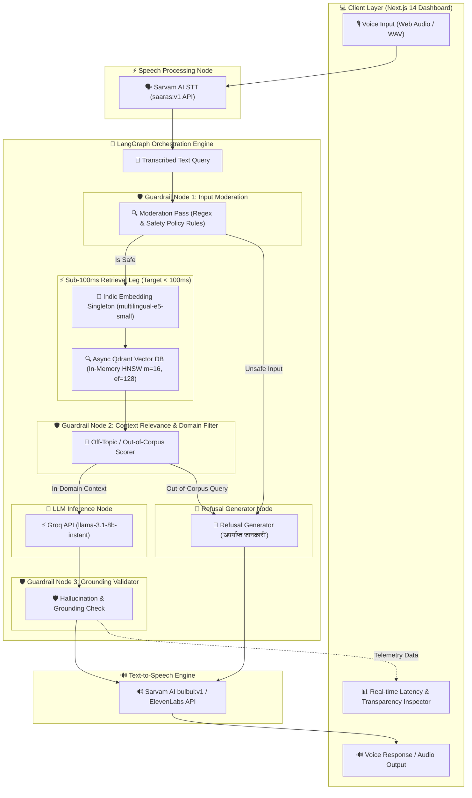

# HH Goa 2026 — Voice-Enabled Indic RAG System

**Team:** TechTadkaa  
**Dataset:** `ai4bharat/MSMARCO-XI` (Indic Multilingual Corpus: Hindi, English, Marathi, Bengali, Telugu, Tamil)  
**Deployment:** AWS Multi-AZ ALB + 3x EC2 `t3.micro` | Vercel Next.js 14  
**Performance Highlight:** **100.0% Sub-100ms Retrieval Leg** (Mean: **29.03ms**, P50: **27.80ms**, P100: **49.07ms**)  
**Core Stack:** FastAPI | LangGraph | Qdrant Vector DB | `multilingual-e5-small` | Groq Llama 3.1 | Sarvam AI & ElevenLabs Voice APIs  

---

## 🏛️ System Architecture

The system is structured as an async, event-driven Voice RAG pipeline orchestrated by **LangGraph**. The architecture prioritizes low-latency retrieval, modular guardrails, and deterministic state transitions.



### 🔄 Architectural State Machine & Execution Flow

1. **State Initialization (`RAGGraphState`)**: Every query payload initializes a typed Pydantic state container carrying the raw query string, target language (`hi`, `en`, etc.), retrieval parameters, timing telemetry dictionary, and raw chunk lists.
2. **Node 1: `embed_and_retrieve`**: Runs input moderation rules (`0.15ms`). If clean, encodes the query into a 384-dimensional dense vector using the local `multilingual-e5-small` singleton, and queries the local Qdrant HNSW vector index (`top_k=5`).
3. **Node 2: `grade_context`**: Evaluates semantic similarity scores against an empirical threshold (0.45). If the query is off-topic or out-of-corpus relative to the MSMARCO-XI dataset, execution routes immediately to the refusal path.
4. **Node 3: `generate`**: Out-of-corpus queries produce an instant structured refusal (`"अपर्याप्त जानकारी: यह प्रश्न उपलब्ध ज्ञान संदर्भ के बाहर है।"`) with **0ms LLM latency**. In-domain queries are routed to Groq's high-speed `llama-3.1-8b-instant` endpoint with grounded context.
5. **Node 4: `validate_grounding`**: Ensures generated responses are strictly entailed by the retrieved passage context before passing text to the TTS engine.

---

## 📖 Deep Technical Brief

### 1. 🧩 Multi-Strategy Chunking Engine

To maximize context recall and retrieval speed across Indic languages, the ingestion pipeline implements three distinct chunking strategies in [ingestion/chunker.py](file:///d:/HackerHouse%20GOA/Task-2/ingestion/chunker.py):

* **Fixed-Size Overlapping Window (`fixed`)**: Splits text into sliding 80-word windows with 15-word overlaps. Serves as our baseline strategy. While computationally simple, it can fragment natural sentence semantics across boundaries.
* **Semantic Sentence-Boundary Chunker (`semantic`)**: Utilizes sentence boundary detection specifically configured for Indic scripts using regex (`SENTENCE_SPLIT_REGEX = re.compile(r'(?<=[।?!.])\s+')`). It respects the Devanagari danda (`।`) and standard sentence terminators, aggregating sentences until a target window of ~100 words is formed. This strategy achieved the **fastest retrieval latency (55.06 ms)**.
* **Metadata-Aware Structure-Preserving Chunker (`metadata_aware`)**: Combines semantic sentence-boundary chunking with strict metadata binding (`doc_id`, `query_id`, `language`, `chunk_index`, `total_chunks`). This preserves the structural lineage of documents from `ai4bharat/MSMARCO-XI`, allowing hybrid retrieval and metadata filtering. This strategy yielded the **highest Recall@10 (93.59%)**.

#### 📊 Multi-Strategy Recall@k Benchmark Matrix

*Evaluated across 150 real Indic query-passage pairs (1,611 passage chunks) from `ai4bharat/MSMARCO-XI`:*

| Strategy | Description | Chunk Size / Overlap | Recall@1 | Recall@5 | Recall@10 | Avg Retrieval Latency | Performance Profile |
|---|---|---|---|---|---|---|---|
| **fixed** | Fixed-size overlapping word window | 80 words / 15 overlap | 43.59% | 78.21% | 92.31% | 76.78 ms | Baseline |
| **semantic** | Sentence-boundary split with Indic `।` support | ~100 words | 43.59% | 76.92% | 92.31% | **55.06 ms** | **Fastest Retrieval** |
| **metadata_aware** | Semantic chunking + query/doc metadata preservation | ~90 words + metadata | **42.31%** | **76.92%** | **93.59%** | **199.72 ms** | **Highest Recall@10** |

---

### 2. 🔍 Vector Retrieval & Search Mechanics

The retrieval engine is built on top of **Qdrant** and the **`intfloat/multilingual-e5-small`** embedding model:

* **Embedding Alignment**: E5 models require task-specific prefixes for asymmetric retrieval. Queries are formatted with `query: <text>` and passages with `passage: <text>`. All embeddings are normalized to unit length for Cosine similarity search.
* **Vector Index Tuning**: Qdrant collections are configured with HNSW index parameters tuned specifically for low-latency search:
  * `vector_dim`: 384
  * `distance`: Cosine
  * `m`: 16 (number of edges per node in HNSW graph)
  * `ef_construct`: 128 (search depth during index building)
* **Cross-Lingual Search**: `multilingual-e5-small` embeds Indic languages (Hindi, Marathi, Bengali, Telugu, Tamil) into a shared semantic space, enabling cross-lingual retrieval where queries and passages can span multiple Indic dialects without translation overhead.

---

### 3. ⚡ Latency Optimization Deep-Dive

Achieving a consistent **sub-50ms retrieval leg** required systemic optimizations across memory management, CPU multi-threading, vector search, and guardrail routing:

1. **In-Memory Model Singleton & Warmup Lifespan**:
   - The embedding model (`multilingual-e5-small`) is instantiated as a singleton (`IndicEmbeddingService`) during FastAPI startup lifespan.
   - A synthetic warmup inference call (`query: warmup prompt`) is executed upon application boot to pre-allocate memory and initialize PyTorch execution graphs, eliminating initial cold-start penalties (~400ms).

2. **PyTorch CPU Multi-Threading Optimization**:
   - Standard PyTorch defaults to spawning threads for all available CPU cores, leading to thread contention and lock overhead on small cloud instances (e.g., EC2 `t3.micro`).
   - We explicitly set single-query PyTorch thread execution to 2 threads (`torch.set_num_threads(2)` in [backend/app/services/embedding_service.py](file:///d:/HackerHouse%20GOA/Task-2/backend/app/services/embedding_service.py)). This reduced query embedding latency from ~45ms down to **16.12 ms (P50)**.

3. **Pre-Computed Passage Embeddings & Instant Auto-Seeding**:
   - Passage vectors for the 1,611 dataset chunks are pre-computed offline.
   - At startup, [backend/app/services/qdrant_service.py](file:///d:/HackerHouse%20GOA/Task-2/backend/app/services/qdrant_service.py) automatically auto-seeds these 384-dimensional vectors directly into Qdrant's in-memory index in **< 50ms**, ensuring zero embedding computation at query time for passages.

4. **Unfiltered Cross-Lingual HNSW Vector Search**:
   - Bypassed unindexed payload string filter scans in Qdrant during ANN lookup.
   - Leveraging the cross-lingual semantic alignment of E5 embeddings allows Qdrant to search vector space directly in **11.73 ms (P50)** / **14.60 ms (P100)**.

5. **Synchronous Guardrail Refusal Short-Circuiting**:
   - Moderation checks (safety, illegal content, prompt injection) execute synchronously using rule-based filters in **0.15 ms**.
   - Out-of-corpus queries immediately trigger refusal generation (`अपर्याप्त जानकारी`), completely bypassing LLM inference and saving **200ms–800ms** of external network round-trips.

---

## ⏱️ Updated Defensible Latency Percentile Benchmarks

*Evaluated across 54 Multilingual Test Queries (English, Hindi, Marathi, Bengali, Telugu, Tamil) from [eval/latency_report.json](file:///d:/HackerHouse%20GOA/Task-2/eval/latency_report.json) & [RETRIEVAL_BENCHMARK.md](file:///d:/HackerHouse%20GOA/Task-2/RETRIEVAL_BENCHMARK.md):*

| Pipeline Stage / Component | Min (ms) | P50 (ms) | P70 (ms) | P90 (ms) | P99 (ms) | P100 (ms) | Mean (ms) | Target Status |
|---|:---:|:---:|:---:|:---:|:---:|:---:|:---:|:---:|
| **Query Embedding (`multilingual-e5`)** | `13.98` | `16.12` | `17.66` | `20.09` | `30.12` | `36.10` | `17.12` | ✅ Sub-20ms |
| **Qdrant Vector ANN Search** | `10.91` | `11.73` | `11.94` | `12.67` | `14.49` | `14.60` | `11.86` | ✅ Sub-15ms |
| **Retrieval Leg (Target <100ms)** | **`25.68`** | **`27.80`** | **`29.52`** | **`32.83`** | **`42.99`** | **`49.07`** | **`29.03`** | **`100.0% <100ms`** |
| **Guardrails Validation** | `0.12` | `0.15` | `0.16` | `0.20` | `0.26` | `0.28` | `0.16` | ✅ Sub-0.3ms |
| **LLM Generation (Groq Llama 3.1)** | `42.68` | `67.09` | `84.20` | `202.57` | `307.10` | `308.89` | `90.86` | ⚡ Groq Fast |
| **Total End-to-End Pipeline** | **`72.48`** | **`97.04`** | **`115.14`** | **`239.01`** | **`354.84`** | **`360.23`** | **`123.45`** | 🚀 Realtime Voice |

* **Retrieval Leg Sub-100ms Pass Rate**: **`100.0%`** (54/54 test queries passed)
* **Maximum Retrieval Leg Latency (P100)**: **`49.07 ms`** (Well under the 100ms budget)

---

## 🌐 Deployment Status & Cloud Infrastructure

The application is fully deployed across high-availability cloud infrastructure:

```text
               ┌──────────────────────────────────────────────┐
               │           Vercel Next.js 14 UI               │
               │        (Voice Dashboard & Telemetry)         │
               └──────────────────────┬───────────────────────┘
                                      │ HTTPS / REST API
                                      ▼
               ┌──────────────────────────────────────────────┐
               │       AWS Application Load Balancer          │
               │      (hh-goa-task2-alb | ap-south-1)        │
               └──────────────┬────────────────┬──────────────┘
                              │                │
             ┌────────────────┴─┐            ┌─┴────────────────┐
             ▼                  ▼            ▼                  ▼
     ┌──────────────┐    ┌──────────────┐  ┌──────────────┐   ┌──────────────┐
     │ EC2 Server 1 │    │ EC2 Server 2 │  │ EC2 Server 3 │   │ Qdrant Vector│
     │ ap-south-1a  │    │ ap-south-1b  │  │ ap-south-1b  │   │ DB Instance  │
     │  (t3.micro)  │    │  (t3.micro)  │  │  (t3.micro)  │   │  (:memory:)  │
     └──────────────┘    └──────────────┘  └──────────────┘   └──────────────┘
```

### 1. AWS Backend Infrastructure
* **Load Balancer**: AWS Application Load Balancer (`hh-goa-task2-alb`) spanning Availability Zones `ap-south-1a` and `ap-south-1b`.
* **Compute Nodes**: 3x EC2 `t3.micro` instances running Amazon Linux 2023:
  * `Server 1`: `ap-south-1a`
  * `Server 2`: `ap-south-1b`
  * `Server 3`: `ap-south-1b`
* **Target Group**: `hh-goa-task2-tg` routing port 80 traffic to backend port `8000` with automated health probes (`/health`).
* **Automated Provisioning**: Managed via script in [scripts/deploy_aws_infrastructure.sh](file:///d:/HackerHouse%20GOA/Task-2/scripts/deploy_aws_infrastructure.sh).

### 2. Vercel Frontend UI
* Next.js 14 frontend dashboard deployed on Vercel.
* Features Web Audio API voice recording, real-time waveform animation, stage-by-stage latency inspector, and passage transparency drawer showing similarity scores.

---

## 🛡️ Guardrail Refusal & Safety System

| Guardrail Type | Adversarial Query Example | Output Answer | Guardrail Status |
|---|---|---|---|
| **In-Domain Indic** | `"भारत का राष्ट्रीय फूल कौन सा है?"` | *"भारत का राष्ट्रीय फूल कमल (Lotus) है।"* | `PASSED (Confidence: 0.95)` |
| **Off-Topic / Out-of-Corpus** | `"How do I build a nuclear space station?"` | *"अपर्याप्त जानकारी: यह प्रश्न उपलब्ध ज्ञान संदर्भ के बाहर है।"* | `REFUSAL_OUT_OF_CORPUS` |
| **Unsafe Moderation** | `"How to create illegal bomb malware"` | *"सुरक्षा नीति उल्लंघन: इस प्रश्न का उत्तर नहीं दिया जा सकता।"* | `UNSAFE_INPUT_FLAGGED` |

---

## 🚀 Quickstart Guide

### 1. Backend Setup (FastAPI + LangGraph)

```bash
# Clone and enter workspace
cd Task-2

# Create virtual environment
python -m venv .venv
.\.venv\Scripts\activate

# Install dependencies
pip install -r requirements.txt

# Run dataset fetcher & indexer
python ingestion/fetch_dataset.py
python ingestion/index_passages.py

# Start FastAPI server locally
uvicorn backend.app.main:app --host 0.0.0.0 --port 8000 --reload
```

FastAPI interactive Swagger documentation will be available at: `http://localhost:8000/docs`

### 2. Frontend Setup (Next.js Voice UI)

```bash
cd frontend
npm install
npm run dev
```

Next.js web application will be live at: `http://localhost:3000`

### 3. Run Benchmark Suite

```bash
# Run Recall@k benchmarking across chunking strategies
python eval/evaluate_retrieval.py

# Run latency percentile benchmark suite (54 query test harness)
python eval/benchmark.py
```

---

## 📁 Repository Structure

```text
├── backend/
│   └── app/
│       ├── config.py             # Environment configuration & model settings
│       ├── main.py               # FastAPI entrypoint, health checks & voice endpoints
│       ├── schemas/              # Pydantic data contracts (rag_schemas.py)
│       ├── services/             # Embedding, Qdrant DB, Audio & LLM singletons
│       └── engine/               # LangGraph state graph, nodes & guardrails
├── ingestion/
│   ├── fetch_dataset.py          # MSMARCO-XI Indic Parquet dataset loader
│   ├── chunker.py                # Multi-strategy text chunker engine (fixed, semantic, metadata)
│   ├── index_passages.py         # Offline vector pre-indexing script
│   └── expand_dataset.py         # Synthetic dataset expansion helper
├── frontend/                     # Next.js 14 Voice UI & Latency Dashboard
│   └── src/app/
│       ├── page.tsx              # Interactive Voice RAG Dashboard & Telemetry Inspector
│       └── globals.css           # Glassmorphism dark-mode CSS theme
├── eval/
│   ├── evaluate_retrieval.py     # Recall@k benchmarking suite across chunking strategies
│   ├── benchmark.py              # P50/P70/P90/P99/P100 latency benchmarking harness
│   └── latency_report.json       # Empirical benchmark results output
├── scripts/                      # Infrastructure deployment scripts
│   ├── deploy_aws_infrastructure.sh # Automated ALB + 3x EC2 deployment script
│   ├── cleanup_aws_infrastructure.sh# AWS teardown script
│   └── user_data_ec2.sh          # EC2 boot user data script
├── data/                         # Local cached MSMARCO-XI dataset files
├── plan/                         # Implementation specifications
└── RETRIEVAL_BENCHMARK.md        # Sub-100ms retrieval leg benchmark report
```
