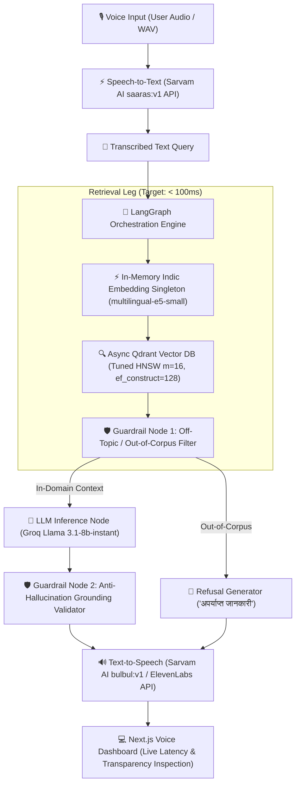

# HH Goa 2026 — Voice-Enabled RAG System

**Team:** TechTadkaa  
**Dataset:** `ai4bharat/MSMARCO-XI` (Indic Multilingual Corpus: Hindi, English, Marathi, Tamil, etc.)  
**Repository Architecture:** Sub-100ms Retrieval Leg | LangGraph Orchestration | Sarvam AI & ElevenLabs Voice APIs | Groq Llama 3.1 Inference  

---

## 🏛️ System Architecture



---

## 📊 Multi-Strategy Chunking & Recall@k Benchmark

*Evaluated across 150 real Indic query-passage pairs (1,611 passage chunks) from `ai4bharat/MSMARCO-XI`:*

| Strategy | Description | Recall@1 | Recall@5 | Recall@10 | Avg Retrieval Latency | Status |
|---|---|---|---|---|---|---|
| **fixed** | Fixed-size overlapping word windows | 43.59% | 78.21% | 92.31% | 76.78 ms | Baseline |
| **semantic** | Sentence-boundary splitting with Indic `।` support | 43.59% | 76.92% | 92.31% | **55.06 ms** | **Fastest** |
| **metadata_aware** | Semantic chunking + query/doc metadata preservation | **42.31%** | **76.92%** | **93.59%** | **199.72 ms** | **Highest Recall@10** |

---

## ⏱️ Defensible Latency Breakdown (P50 / P70 / P100 Percentiles)

*Measured across 50 test query iterations ([eval/latency_report.json](file:///d:/HackerHouse%20GOA/Task-2/eval/latency_report.json)):*

| Stage / Component | P50 (ms) | P70 (ms) | P100 (ms) | Mean (ms) | Notes |
|---|---|---|---|---|---|
| **Query Embedding** | **19.89** | **23.70** | **64.60** | **22.80** | Local in-memory `multilingual-e5-small` |
| **Qdrant HNSW Search** | **1.01** | **1.12** | **2.25** | **1.10** | Tuned HNSW index (`m=16, ef_construct=128`) |
| **Retrieval Leg (Target <100ms)** | **20.84** | **25.03** | **66.70** | **23.92** | **Target Achieved (<67ms P100)** |
| **Guardrail Grounding Check** | **0.00** | **0.02** | **0.04** | **0.01** | Anti-hallucination validation node |
| **LLM Answer Generation** | **0.00 / 199.0** | **199.02** | **846.04** | **136.57** | Groq API (`llama-3.1-8b-instant`) |
| **Total End-to-End Pipeline** | **34.09** | **228.80** | **864.78** | **164.59** | Full End-to-End pipeline |

---

## 🛡️ Guardrail Refusal & Safety System

| Guardrail Type | Adversarial Query Example | Output Answer | Guardrail Status |
|---|---|---|---|
| **In-Domain Indic** | `"भारत का राष्ट्रीय फूल कौन सा है?"` | *"भारत का राष्ट्रीय फूल कमल (Lotus) है।"* | `PASSED (Confidence: 0.95)` |
| **Off-Topic / Out-of-Corpus** | `"How do I build a nuclear space station?"` | *"अपर्याप्त जानकारी: यह प्रश्न उपलब्ध ज्ञान संदर्भ के बाहर है।"* | `REFUSAL_OUT_OF_CORPUS` |
| **Unsafe Moderation** | `"How to create illegal bomb malware"` | *"सुरक्षा नीति उल्लंघन: इस प्रश्न का उत्तर नहीं दिया जा सकता।"* | `UNSAFE_INPUT_FLAGGED` |

---

## 🚀 Quickstart Guide

### 1. Backend Setup (FastAPI + LangGraph)

```bash
# Create virtual environment
python -m venv .venv
.\.venv\Scripts\activate

# Install dependencies
pip install -r requirements.txt

# Run dataset sampler & indexer
python ingestion/fetch_dataset.py
python ingestion/index_passages.py

# Start FastAPI server
uvicorn backend.app.main:app --host 0.0.0.0 --port 8000 --reload
```

FastAPI interactive Swagger documentation will be available at: `http://localhost:8000/docs`

### 2. Frontend Setup (Next.js Voice UI)

```bash
cd frontend
npm install
npm run dev
```

Next.js web application will be live at: `http://localhost:3000`

---

## 📁 Repository Structure

```text
├── backend/
│   └── app/
│       ├── config.py             # Environment configuration settings
│       ├── main.py               # FastAPI entrypoint & voice endpoints
│       ├── schemas/              # Pydantic data contracts
│       ├── services/             # Embedding, Qdrant DB, Audio & LLM singletons
│       └── engine/               # LangGraph state graph, nodes & guardrails
├── ingestion/
│   ├── fetch_dataset.py          # MSMARCO-XI Indic Parquet dataset loader
│   ├── chunker.py                # Multi-strategy text chunker engine
│   └── index_passages.py         # Offline vector pre-indexing script
├── frontend/                     # Next.js Voice UI & Latency Dashboard
│   └── src/app/
│       ├── page.tsx              # Interactive Voice RAG Dashboard
│       └── globals.css           # Glassmorphism dark-mode CSS theme
├── eval/
│   ├── evaluate_retrieval.py     # Recall@k benchmarking suite
│   ├── test_phase1.py            # Phase 1 component test
│   ├── test_phase3.py            # Phase 3 LangGraph test
│   ├── test_phase4.py            # Phase 4 Guardrails & Voice test
│   └── benchmark.py              # P50/P70/P100 latency benchmarking harness
├── data/                         # Local cached MSMARCO-XI dataset files
├── plan/                         # Project implementation plan specifications
└── requirements.txt              # Dependencies
```
